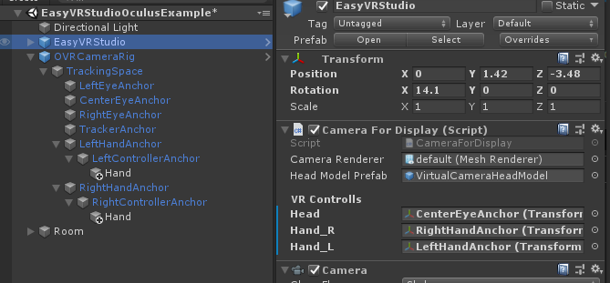

# EasyVRStudio

## Overview

自作のVRアプリに簡単に仮想カメラを配置し、[OBS Studio](https://obsproject.com/ja/download) および [VaNiiMenu](https://sabowl.sakura.ne.jp/gpsnmeajp/unity/vaniimenu/) と連動することで、ZoomやTeamsなどオンラインミーティングアプリに、VR空間から参加するための機能を提供します。


仮想カメラ機能を利用することでデスクトップ画面には、第三者視点のカメラをスイッチングして表示することができます。

また、FirstPesonViewそのままでは、頭部の追随による画面ブレが激しいため、それを低減するスタビライザとしても利用できます。

本パッケージが提供する機能は、仮想カメラの配置とキーボード操作によるカメラ切り替え機能のみで、オンラインミーティングに参加するには、別ソフトウェアである [OBS Studio](https://obsproject.com/ja/download) および [VaNiiMenu](https://sabowl.sakura.ne.jp/gpsnmeajp/unity/vaniimenu/) と連携することを想定して作成されています。


----

## Working environment
* Unity 2019.2.x
* Windows Standalone
* SteamVR 推奨 
  - 本パッケージ自体はWindows上でSteamVR以外でも動作しますが、連動して利用するVaNiiMenu がSteamVRのオーバーレイ機能を利用しています。

----

## How to Use
### サンプルシーンを動かす
1. このリポジトリをCloneして、Unity Editorで開いてください。
2. 以下のシーンを実行してください。
    ```
    Assets/EasyVRStudio/Scenes/EasyVRStudioOculusExample.scene
    ```
3. 実行中にF1-F6 のキーを押すと仮想カメラが切り替わります。（デスクトップアプリの画面を確認してください）


### 自作のVRアプリに組み込む
1. [Release](https://github.com/the6th/EasyVRStudio/releases)から最新のUnityPackage をダウンロードしてください。
2. Package を自作VRアプリに組み込み、シーンに
    ```
    Assets/EasyVRStudio/Prefabs/EasyVRStudio.prefab
    ```
    を配置してください。

3. EasyVRStudio > [Camera For Display]コンポーネントのInspectorに、VR Controllsという項目があります。
ここに、頭部・右手・左手のTransformを関連付けてください。


3. この状態で実行Playすると、F1-F6 のキーを押すと仮想カメラが切り替わります。
（デスクトップアプリの画面を確認してください）

4. 仮想カメラの設定は
    
    * [Assets/EasyVRStudio/Scripts/Config.cs](Assets/EasyVRStudio/Scripts/Config.cs)
   
    で定義されています。このファイルを変更することで
    仮想カメラの位置やトリガーキーを切り替えることができます。

    ```
    new DisplayCamera(
      name: "vCenter",            //カメラ名称（任意）
      parent: CameraParent.HEAD,  //親オブジェクト(CameraParent.HEAD/CameraParent.HAND_L/CameraParent.HAND_R)
      position: Vector3.zero,     //親オブジェクトからのローカル座標
      eulerAngles: new Vector3(10f,0,0),//親オブジェクトからのローカルオイラー角
      keyCode: KeyCode.F1         //切り替えキー
    ),
    ```
初期設定では以下の仮想カメラが切り替え可能となっています。

|キー操作|仮想カメラ|
|---|---|
|F1|FirstPersonView ブレ補正付き|
|F2|対面View|
|F3|天井からの見降ろしView（手元の作業を見せたい場合を想定）|
|F4|右コントローラに追随するハンドカメラ風|
|F5|左コントローラに追随するハンドカメラ風|
|F6|機能無効/パススルー（FirstPersonViewそのまま）|


---

### Zoomなどミーティングアプリと連動する
オンラインミーティングに参加するには、他のThirdParty アプリとの連動が必要です。

#### OBS Studio
* OBS StudioおよびOBS-VirtualCam を利用することで、特定のウインドウをミーティングアプリのカメラ映像入力として利用することができます。
   - [OBS Studio 25.0.8](https://obsproject.com/ja/download)
   - [OBS-VirtualCam 2.0.4](https://obsproject.com/forum/resources/obs-virtualcam.539/)
   - [OBSをバーチャルカメラとして出力してZoomやTeamsで映像ソースとして認識させる方法](https://level69.net/archives/26918)(参考)

#### VaNiiMenu

* [VaNiiMenu](https://sabowl.sakura.ne.jp/gpsnmeajp/unity/vaniimenu/)

VaNiiMenuを利用することで自作VRアプリ空間上にデスクトップ画面を表示することができます。

また、デスクトップ画面を表示しながらファンクションキーを送信する機能があります。


この機能を利用することで

* VR空間上でEasyVRStudioのカメラ視点の切り替え
* 切り替え状態のモニタリング
* オンラインミーティングアプリの画面表示

を行うことができます。


----

### Avatorを変更する
通常の１人称視点のVRアプリでは、頭部など、手（コントローラ）以外の部分のアバターは作成していない事もあると思います。

このパッケージでは簡易的な頭部しか提供していませんので、
オリジナルのアバターを利用する場合は
VRMとFinalIKを組み合わせるなどしてご自身で用意してください。

* [VRM](https://vrm.dev/)
* [Final IK](https://assetstore.unity.com/packages/tools/animation/final-ik-14290?locale=ja-JP)
* [VRoid StudioのVRMモデルを使ってノンコーディングでVTuberのように動かす](https://techblog.forgevision.com/entry/2018/08/29/155803)(参考)


----

## License
このリポジトリには以下のライブラリが含まれています。

* [Oculus Integration](https://assetstore.unity.com/packages/tools/integration/oculus-integration-82022)
   - This is a Restricted Asset pursuant to the Asset Store EULA. Your use of this SDK is governed by the Oculus SDK License:
https://developer.oculus.com/licenses/sdk-3.5
   - Copyright © Facebook Technologies, LLC and its affiliates. All rights reserved.

* [Standard Assets (for Unity 2017.3)](https://assetstore.unity.com/packages/essentials/asset-packs/standard-assets-for-unity-2017-3-32351)

