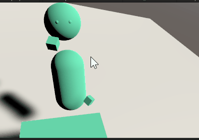

# EasyVRCamera

## Overview

自作のVRアプリに簡単に仮想カメラを配置し、ZoomやTeamsなどオンラインミーティングに、VR空間から参加するための機能を提供するアセットです。

仮想カメラ機能を利用することでデスクトップ画面には、第三者視点のカメラをスイッチングして表示することができます。

本パッケージが提供する機能は、仮想カメラの配置とキーボード操作によるカメラ切り替え機能のみで、オンラインミーティングに参加するには、別ソフトウェアである[OBS Studio](https://obsproject.com/ja/download)および[VaniiMenu](https://sabowl.sakura.ne.jp/gpsnmeajp/unity/vaniimenu/)と連携することを想定して作成されています。



----

## How to Use
### サンプルシーンを動かす
1. このリポジトリをCloneして、Unity Editorで開いてください。
2. 以下のシーンを実行してください。
    ```
    Assets/EasyVRStudio/Scenes/EasyVRStudioOculusExample.scene
    ```
3. 実行中にF1-F6 のキーを押すと仮想カメラが切り替わります。（デスクトップアプリの画面を確認してください）


### 自作のVRアプリに組み込む
1. Releaseページから最新のUnityPackage をダウンロードしてください。
2. Package を自作VRアプリに組み込み、シーンに
    ```
    Assets/EasyVRStudio/Prefabs/EasyVRStudio.prefab
    ```
    を配置してください。

3. EasyVRStudio > [Camera For Display]コンポーネントのInspectorに、VR Controllsという項目があります。
ここに、頭部・右手・左手のTransformを関連付けてください。


3. この状態で実行Playすると、F1-F6 のキーを押すと仮想カメラが切り替わります。
（デスクトップアプリの画面を確認してください）

4. 仮想カメラの設定は
    ```
    Assets/EasyVRStudio/Scripts/Config.cs
    ```
    で定義されています。このファイルを変更することで
    仮想カメラの位置やトリガーキーを切り替えることができます。

    ```
    new DisplayCamera(
    name: "vCenter",
    parent: CameraParent.HEAD,
    position: Vector3.zero,
    eulerAngles: new Vector3(10f,0,0),
    keyCode: KeyCode.F1
    ),
    ```
----


## License
このリポジトリには以下のライブラリが含まれています。

* [Oculus Integration](https://assetstore.unity.com/packages/tools/integration/oculus-integration-82022)
   - This is a Restricted Asset pursuant to the Asset Store EULA. Your use of this SDK is governed by the Oculus SDK License:
https://developer.oculus.com/licenses/sdk-3.5
   - Copyright © Facebook Technologies, LLC and its affiliates. All rights reserved.

* [Standard Assets (for Unity 2017.3)](https://assetstore.unity.com/packages/essentials/asset-packs/standard-assets-for-unity-2017-3-32351)

